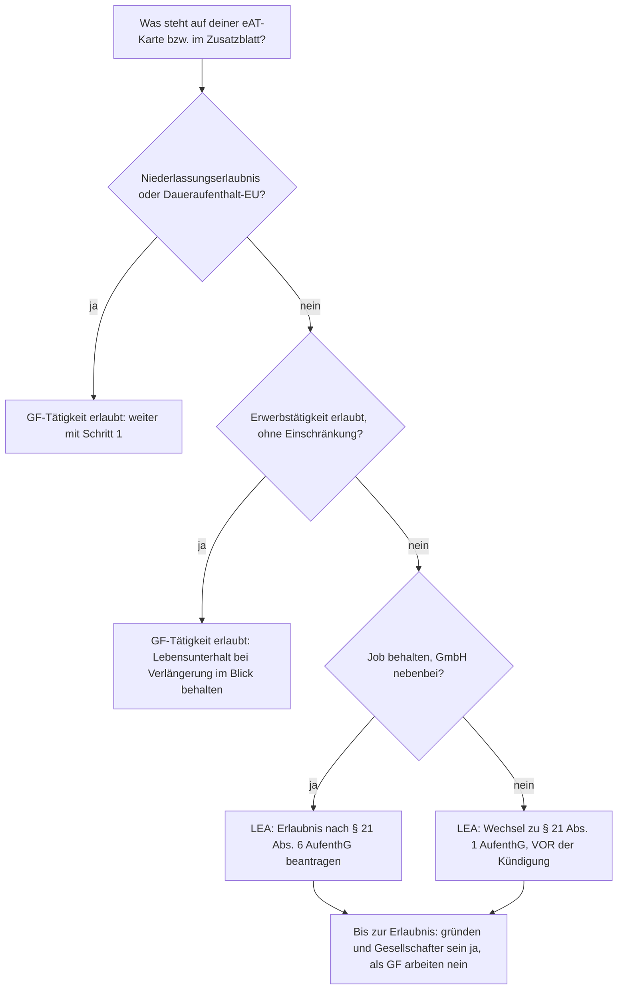

# GmbH-Gründung in Berlin – mit bosnischem Pass und deutschem Aufenthaltstitel

- Stand: 2026-09-28
- Ausgangslage: Du gründest **allein**, hältst **100 %** und bist **einziger Geschäftsführer (GF)**. Sitz ist **Berlin**. Du hast die Staatsangehörigkeit Bosnien und Herzegowina und einen deutschen Aufenthaltstitel.
- Offen: genauer Aufenthaltstitel, GmbH oder UG, Tätigkeit (siehe [[#10. Offene Punkte]]).

> [!warning] Keine Rechts- oder Steuerberatung
> Dieser Leitfaden bündelt die öffentlich verfügbaren Regeln (Stand oben). Den Aufenthaltsteil verbindlich mit dem **LEA Berlin** oder einer Fachanwältin bzw. einem Fachanwalt für Migrationsrecht klären, die Steuern mit einer Steuerberatung. Beträge sind Richtwerte.

---

## TL;DR

1. **Gesellschafter sein darfst du immer.** Anteile halten ist keine Erwerbstätigkeit und hängt nicht vom Aufenthaltstitel ab.
2. **Als Geschäftsführer arbeiten darfst du nur, wenn dein Titel selbständige Tätigkeit erlaubt.** Das ist der einzige echte Blocker, deshalb kommt er als [[#0. Aufenthaltsrecht – Schritt 0, vor dem Notar|Schritt 0]] vor allem anderen.
3. Mit 100 % Anteil und GF-Posten giltst du aufenthaltsrechtlich und in der Regel auch sozialversicherungsrechtlich als **Selbständiger**.
4. Ablauf: Titel prüfen → Name & Musterprotokoll → Notar → Konto & Einzahlung → Handelsregister (**Amtsgericht Charlottenburg**) → Transparenzregister → Gewerbeamt (Bezirksamt) → Finanzamt für Körperschaften.
5. Einmalkosten für Notar und Register: ca. **400–1.000 €** (Musterprotokoll), dazu das Stammkapital. Dauer ab Notartermin: meist **2–6 Wochen**. Muss vorher ein Aufenthaltstitel geändert werden, kommen **Wochen bis Monate** dazu.

---

## 0. Aufenthaltsrecht – Schritt 0, vor dem Notar

### Grundregel

- Wer einen Aufenthaltstitel hat, darf grundsätzlich erwerbstätig sein, **außer ein Gesetz verbietet oder beschränkt es**. Dann braucht jede weitere Tätigkeit eine Erlaubnis (§ 4a AufenthG).
- Als GF deiner eigenen GmbH (100 %) bist du **selbständig**. Das LEA Berlin behandelt GF von Kapitalgesellschaften nur dann als Selbständige nach § 21 AufenthG, wenn sie **mindestens 50 %** der Anteile halten. Mit 100 % erfüllst du das.
- **Maßgeblich ist dein eAT-Zusatzblatt** (bzw. die „Anmerkungen“ auf der Karte). Dort steht, ob die Erwerbstätigkeit erlaubt oder beschränkt ist.

### Entscheidungstabelle nach Titel

| Dein Titel (Paragraf auf der Karte) | Darfst du GF deiner 100 %-GmbH sein? | Was zu tun ist |
|---|---|---|
| **Niederlassungserlaubnis** (§ 9) oder **Daueraufenthalt-EU** (§ 9a) | ✅ Ja, ohne Einschränkung | Direkt mit [[#2. Ablauf Schritt für Schritt (Berlin)\|Schritt 1]] starten. |
| **Familiennachzug** (§§ 28–30, 32, 36; Erwerbstätigkeit nach § 27 Abs. 5) | ✅ Ja, abhängige und selbständige Arbeit | Zusatzblatt prüfen. Risiko: Bei der Verlängerung muss der **Lebensunterhalt gesichert** sein (siehe [[#6. Risiken und Randfälle]]). |
| Anderer Titel mit dem Eintrag **„Erwerbstätigkeit erlaubt“** ohne Einschränkung | ✅ In der Regel ja | Zusatzblatt prüfen. Im Zweifel beim LEA schriftlich bestätigen lassen. |
| **Fachkraft** (§ 18a/18b), **Blaue Karte EU** (§ 18g), **Westbalkanregelung** (§ 19c Abs. 1 i. V. m. § 26 Abs. 2 BeschV) oder anderer Titel mit „Beschäftigung nur bei …“ | ❌ Nicht automatisch | **Weg A:** Du behältst deinen Job und machst die GmbH nebenbei. Dann beim LEA die **Erlaubnis zur selbständigen Tätigkeit nach § 21 Abs. 6 AufenthG** beantragen, der Aufenthaltszweck bleibt. **Weg B:** Die GmbH wird Hauptberuf. Dann **Wechsel zu § 21 Abs. 1 AufenthG** beantragen, und zwar **vor** der Kündigung. |
| **Studium** (§ 16b), **Ausbildung** (§ 16a), **Chancenkarte** (§ 20a) u. Ä. | ⚠️ Stark eingeschränkt | Selbständige Tätigkeit nur mit Erlaubnis des LEA. Einzeln prüfen lassen. |
| **Duldung** oder **Aufenthaltsgestattung** | ❌ Praktisch ausgeschlossen | Gesellschafter sein ja, GF-Tätigkeit nein. Vorher Fachanwalt fragen. |



### Wenn du eine Erlaubnis nach § 21 brauchst (Berlin)

- **Voraussetzungen nach § 21 Abs. 1 AufenthG:** Es gibt ein wirtschaftliches Interesse oder einen regionalen Bedarf, die Tätigkeit wirkt sich voraussichtlich positiv auf die Wirtschaft aus, und die Finanzierung ist durch Eigenkapital oder eine Kreditzusage gesichert.
- **IHK Berlin:** Das LEA holt eine fachliche Stellungnahme ein. Deshalb brauchst du einen belastbaren **Businessplan mit Finanz-, Umsatz- und Liquiditätsplan** und einen Kapitalnachweis.
- **Antrag:** nur über den **Online-Antrag des LEA Berlin** („Aufenthaltserlaubnis für selbständig oder freiberuflich tätige Personen“). Fehlende Unterlagen fordert das LEA danach an.
- **Berlin-Spezifika für Kapitalgesellschaften** (laut Angaben des LEA, per Websuche ermittelt; die Seiten waren hier nicht direkt abrufbar, also vor dem Antrag auf berlin.de/einwanderung prüfen):
  - GF muss **mindestens 50 %** halten.
  - Die GmbH muss **im Handelsregister eingetragen** sein, mindestens aber notariell zur Eintragung angemeldet.
  - In den Suchergebnissen wird für GF von Kapitalgesellschaften ein **Jahres-Nettoeinkommen von mindestens 41.000 €** genannt. Diesen Betrag und worauf er sich bezieht unbedingt beim LEA verifizieren.
- **Ab 45 Jahren** musst du zusätzlich eine angemessene Altersversorgung nachweisen (§ 21 Abs. 3).
- **Nach 3 Jahren** kann es eine Niederlassungserlaubnis geben, wenn die Tätigkeit erfolgreich ist und den Lebensunterhalt sichert (§ 21 Abs. 4).
- **Business Immigration Service (BIS):** Das LEA Berlin betreut Gründerinnen, Gründer und Investoren in ausgewählten Fällen bevorzugt. Den Kontakt vermitteln in der Regel **Berlin Partner** oder die **IHK Berlin**.
- **Henne-Ei-Problem lösen:** Zuerst gründen (das darfst du als Gesellschafter), dann den Antrag stellen. Die GF-Tätigkeit übst du **erst mit der Erlaubnis** aus. Ob du dich schon vorher als GF eintragen lässt oder übergangsweise jemand anderes bestellst, vorher mit dem LEA abstimmen.

---

## 1. Entscheidungen vor dem Notar

### 1.1 GmbH oder UG (haftungsbeschränkt)

| Kriterium | **GmbH** | **UG (haftungsbeschränkt)** |
|---|---|---|
| Stammkapital | mind. 25.000 € | ab 1 € |
| Bei Anmeldung einzuzahlen | mind. 12.500 € (§ 7 Abs. 2 GmbHG) | **voller Betrag**, nur Bargeld (§ 5a Abs. 2) |
| Gewinnverwendung | frei | **25 % des Jahresüberschusses** in die Rücklage, bis 25.000 € erreicht sind (§ 5a Abs. 3) |
| Außenwirkung (Banken, Kunden, **LEA-Prüfung „Finanzierung gesichert“**) | stark | schwächer, bei sehr wenig Kapital deutlich schwächer |
| Später wechseln | – | UG → GmbH durch Kapitalerhöhung auf 25.000 € (Notar) |

**Empfehlung:**
- Kannst du **12.500 € sofort** aufbringen, nimm die **GmbH**. Das stärkt vor allem einen § 21-Antrag, weil das Kapital die gesicherte Finanzierung belegt.
- Sonst eine **UG mit realistischem Kapital (z. B. 1.000–5.000 €)**, **nicht 1 €**. Bei 1 € fressen die Gründungskosten das Kapital sofort auf, und die Gesellschaft ist praktisch vom ersten Tag an überschuldet.

### 1.2 Musterprotokoll oder individuelle Satzung

- **Musterprotokoll** (§ 2 Abs. 1a GmbHG): für höchstens 3 Gesellschafter und 1 GF, also genau dein Fall.
  - Vorteile: deutlich günstiger beim Notar, schnell, GF automatisch von § 181 BGB befreit, die GmbH trägt Gründungskosten bis 300 € (höchstens bis zur Höhe des Stammkapitals).
- **Individuelle Satzung**: sinnvoll, sobald **Mitgründer oder Investoren absehbar** sind (Vinkulierung, Vorkaufsrechte, Einziehung, Vesting).
- **Empfehlung:** Für dich jetzt das **Musterprotokoll**. Kommen später Investoren dazu, wird die Satzung beim Notar ersetzt.

### 1.3 Firma (Name)

- Pflicht: Rechtsformzusatz „GmbH“ bzw. „UG (haftungsbeschränkt)“.
- Der Name muss sich von allen Firmen **am Ort, also in Berlin**, deutlich unterscheiden (§ 30 HGB).
- Prüfen:
  - **IHK Berlin** (kostenlose Firmennamen-Prüfung)
  - **Handelsregister** (handelsregister.de)
  - **Marken** bei DPMA und EUIPO
  - Domain
- Arbeitstitel laut Projektkontext: „LEANS Tech GmbH“. Den Namen vor dem Notartermin wie oben prüfen.

### 1.4 Sitz und Geschäftsanschrift

- Du brauchst eine **inländische Geschäftsanschrift in Berlin** (§ 8 Abs. 4 GmbHG).
- **Privatwohnung** geht, wenn der Mietvertrag die gewerbliche Nutzung erlaubt.
- **Virtual Office** ist rechtlich möglich. Banken und Finanzamt prüfen solche Adressen aber oft kritischer.
- Der **Bezirk** der Anschrift bestimmt das zuständige Gewerbeamt (Ordnungsamt).

### 1.5 Unternehmensgegenstand

- Formuliere ihn konkret und so weit wie nötig, aber ohne ungewollt **erlaubnispflichtige** Tätigkeiten (Handwerk mit Meisterpflicht, Finanzdienstleistung, Bewachung, Makler usw.).

### 1.6 GF-Anstellungsvertrag und Gehalt

- **Schriftlich und vor Beginn** abschließen, das Gehalt **angemessen** ansetzen. Sonst droht eine verdeckte Gewinnausschüttung (vGA).
- Das Gehalt ist zugleich dein Nachweis „**Lebensunterhalt gesichert**“ gegenüber dem LEA.

### 1.7 Holding (optional, später)

- Eine persönliche Holding-GmbH über der operativen GmbH macht **Gewinnausschüttungen und Exit-Erlöse zu ca. 95 % steuerfrei** (§ 8b KStG).
- Kosten: eine zweite Buchhaltung und ein zweiter Jahresabschluss.
- **Empfehlung:** erst bei nennenswerten Gewinnen oder einem absehbaren Exit. Nachträglich ist der Umbau aber aufwändiger, daher mit der Steuerberatung einmal durchrechnen.

---

## 2. Ablauf Schritt für Schritt (Berlin)

| # | Schritt | Wo / wer | Dauer | Kosten (ca.) |
|---|---|---|---|---|
| 0 | Aufenthaltstitel prüfen, ggf. § 21-Erlaubnis | LEA Berlin | 0 Tage bis Monate | ca. 100 € je Titel oder Änderung |
| 1 | Name prüfen, Steuerberatung wählen | IHK Berlin, Register, DPMA | 1–5 Tage | 0 € |
| 2 | Notartermin: Gründung, GF-Bestellung, Registeranmeldung, Gesellschafterliste | Notar (vor Ort oder online) | 1 Termin | siehe [[#3. Kosten (Richtwerte 2026)\|Kosten]] |
| 3 | Geschäftskonto „GmbH i. G.“ eröffnen, Kapital einzahlen, Beleg an den Notar | Bank | 1–10 Tage | 0–20 €/Monat |
| 4 | Eintragung ins Handelsregister (Nummer HRB … B) | Notar → **Amtsgericht Charlottenburg** (für ganz Berlin) | wenige Tage bis mehrere Wochen | 150–225 € |
| 5 | Transparenzregister: dich als wirtschaftlich Berechtigten melden | transparenzregister.de | 1 Tag | gering |
| 6 | Gewerbeanmeldung | **Ordnungsamt des Bezirks**, in dem der Sitz liegt | 1 Termin | ca. 26–31 € |
| 7 | Steuerliche Erfassung (Fragebogen, **innerhalb 1 Monat** nach Aufnahme der Tätigkeit, § 138 AO) | ELSTER → **Finanzamt für Körperschaften I–IV** | Steuernummer nach 2–6 Wochen | 0 € |
| 8 | Berufsgenossenschaft anmelden (**innerhalb 1 Woche**, § 192 SGB VII) | zuständige BG | 1 Tag | nach Beitrag |
| 9 | Pflichten zum Start: Impressum, Angaben auf Geschäftsbriefen (§ 35a GmbHG), Rundfunkbeitrag, Datenschutz, E-Rechnung | du | 1–2 Tage | – |

### Details zu den Schritten

**Schritt 2 – Notar**
- **Unterlagen:**
  - gültiger **bosnischer Reisepass** und **eAT**
  - Meldebescheinigung und Steuer-ID
  - Name, Sitz, Gegenstand, Kapital
- **Online-Gründung:** Seit 2022 ist die Gründung per Videokonferenz über das System der Bundesnotarkammer möglich.
  - Identifizieren kannst du dich mit der **Online-Ausweisfunktion deines eAT** (PIN muss aktiv sein). Das Lichtbild wird per NFC aus dem Chip gelesen.
  - Vorab mit dem Notar klären, ob deine Dokumente in der Ausweisliste der BNotK stehen. Ein Präsenztermin in Berlin geht immer.
- **Sprache:** Reicht dein Deutsch für die Beurkundung nicht sicher aus, zieht der Notar eine Dolmetscherin oder einen Dolmetscher hinzu (§ 16 BeurkG).

**Schritt 3 – Konto**
- Viele Filial- und Direktbanken bieten Kapitaleinzahlungskonten für eine GmbH i. G. an.
- Mit Nicht-EU-Pass gelten bei manchen Neobanken strengere Prüfungen. Pass, eAT und Meldebescheinigung bereithalten.

**Schritt 5 – Transparenzregister**
- Seit 2021 gilt das Transparenzregister als **Vollregister**. Die GmbH muss aktiv melden, dass du wirtschaftlich Berechtigter bist, der Handelsregistereintrag reicht nicht.
- Manche Notare übernehmen die Meldung. Sonst drohen Bußgelder.

**Schritt 6 – Gewerbeamt**
- Mitbringen: Handelsregisterauszug, Gesellschaftsvertrag, Pass und eAT.
- **Das Gewerbeamt prüft bei Nicht-EU-Staatsangehörigen den Aufenthaltstitel.** Spätestens hier fällt eine fehlende Erlaubnis für selbständige Tätigkeit auf.
- Die Online-Anmeldung ist in Berlin laut Ratgeberseiten nur für natürliche Personen möglich. Rechne für die GmbH mit einem Termin beim Bezirksamt.

**Schritt 7 – Finanzamt**
- Zuständig in Berlin sind die **Finanzämter für Körperschaften I–IV**. Welches genau, regelt die Berliner Zuständigkeitsverordnung; die Finanzamtssuche auf berlin.de zeigt es an.
- Im Fragebogen gleich die **USt-IdNr.** beantragen.
- Außerdem dort festlegen: Kleinunternehmerregelung ja/nein (Grenzen seit 2025: 25.000 € im Vorjahr, 100.000 € im laufenden Jahr) und Ist- oder Soll-Versteuerung.

**Schritt 8 – Sozialversicherung**
- Als **100 %-Gesellschafter-GF bist du in der Regel nicht sozialversicherungspflichtig.**
- Kranken- und Pflegeversicherung schließt du selbst ab (freiwillig gesetzlich oder privat). Ein ausreichender Krankenversicherungsschutz ist auch **aufenthaltsrechtlich Pflicht**.
- Optional: Statusfeststellung bei der DRV-Clearingstelle (§ 7a SGB IV).
- Bei der BG bist du als Unternehmer nicht automatisch versichert. Eine freiwillige Unternehmerversicherung ist möglich.

---

## 3. Kosten (Richtwerte 2026)

Die Handelsregistergebühren sind seit dem **1. Juni 2025 um 50 % gestiegen**. Die Notargebühren richten sich nach dem GNotKG, das 2025 ebenfalls angepasst wurde.

| Posten | UG, Musterprotokoll | GmbH (25.000 €), Musterprotokoll | GmbH, individuelle Satzung |
|---|---|---|---|
| Notar | ca. 250–400 € | ca. 450–600 € | ca. 1.000–2.000 € |
| Handelsregister | ca. 150–225 € | ca. 150–225 € | ca. 225 € |
| Gewerbeanmeldung | ca. 30 € | ca. 30 € | ca. 30 € |
| **Summe einmalig** | **ca. 450–700 €** | **ca. 650–900 €** | **ca. 1.300–2.300 €** |
| Stammkapital (bleibt Vermögen der GmbH) | frei wählbar, voll einzahlen | mind. 12.500 € einzahlen | mind. 12.500 € einzahlen |

Dazu kommen gegebenenfalls:
- LEA-Gebühr (ca. 100 €)
- Übersetzungen
- Steuerberatung bei der Gründung (optional)

**Laufende Kosten pro Jahr** (Richtwert kleine GmbH):
- Buchhaltung und Jahresabschluss über Steuerberatung: ca. 2.000–5.000 €
- IHK-Beitrag
- Kontoführung
- Kranken- und Pflegeversicherung (privat)

> [!danger] Fake-Rechnungen nach der Eintragung
> Kurz nach der Eintragung kommen fast immer amtlich aussehende Rechnungen privater Firmen, etwa für „Eintragung in ein Register“. **Bezahle nur Rechnungen vom Notar, von der Justizkasse bzw. dem Amtsgericht und vom Bundesanzeiger bzw. Transparenzregister.**

---

## 4. Zeitplan

```text
Woche 0          Aufenthaltstitel prüfen  ──► falls § 21 nötig: Businessplan + LEA-Antrag (Wochen–Monate, parallel möglich)
Woche 1          Name prüfen, Notartermin, Konto „GmbH i. G.“ eröffnen
Woche 1–2        Kapital einzahlen → Notar reicht die Anmeldung beim AG Charlottenburg ein
Woche 2–6        Eintragung (HRB … B) → Transparenzregister → Gewerbeamt → ELSTER-Fragebogen → BG
Woche 4–10       Steuernummer + USt-IdNr. da → erste Rechnungen mit vollen Pflichtangaben
```

---

## 5. Steuern und laufende Pflichten

### Steuerlast auf den Gewinn der GmbH in Berlin

- Körperschaftsteuer 15 % + Solidaritätszuschlag 5,5 % davon = **15,825 %**
- Gewerbesteuer: 3,5 % Messzahl × **410 % Berliner Hebesatz** = **14,35 %**. Für eine GmbH gibt es **keinen** Freibetrag (die 24.500 € gelten nur für Einzelunternehmen und Personengesellschaften).
- **Zusammen ≈ 30,2 %.**
- **Ab 2028** sinkt die Körperschaftsteuer jedes Jahr um 1 Punkt bis auf **10 % ab 2032** (Gesetz für ein steuerliches Investitionssofortprogramm, Juli 2025). Ab 2032 liegt die Gesamtbelastung dann bei ≈ **24,9 %**.
- **Ausschüttung an dich:** 25 % Abgeltungsteuer + Solidaritätszuschlag (ggf. Kirchensteuer). Alternativ auf Antrag das Teileinkünfteverfahren.
- **GF-Gehalt:** Betriebsausgabe der GmbH, bei dir lohnsteuerpflichtig.
- **Einkünfte oder Wohnsitz in Bosnien und Herzegowina:** Deutschland wendet im Verhältnis zu Bosnien und Herzegowina das DBA mit dem ehemaligen Jugoslawien (1987) weiter an. Mit der Steuerberatung klären, falls relevant.

### Pflichten

- **Buchführung und Bilanz** nach HGB
- **Jahresabschluss** aufstellen (kleine GmbH: bis 6 Monate nach Geschäftsjahresende) und durch die Gesellschafterversammlung feststellen (bis 11 Monate)
- **Offenlegung im Unternehmensregister** innerhalb von 12 Monaten
- **Steuererklärungen:** E-Bilanz, Körperschaft-, Gewerbe- und Umsatzsteuererklärung, **Umsatzsteuer-Voranmeldungen** (nach Vorgabe des Finanzamts)
- **E-Rechnung:** Empfangen seit 2025 Pflicht. Ausstellen im B2B-Bereich ab 2027 (bei Vorjahresumsatz über 800.000 €), ab 2028 für alle.
- **Bei Änderungen:** Gesellschafterliste, Transparenzregister, Handelsregister und **LEA** (Titel und Tätigkeit) aktualisieren.

---

## 6. Risiken und Randfälle

Die aufenthaltsrechtlichen Punkte 1–5 sind die wichtigsten.

1. **Als GF arbeiten, bevor der Titel es erlaubt** gilt als unerlaubte Erwerbstätigkeit. Das kann zu Bußgeld führen und gefährdet die Verlängerung. Solange es nicht erlaubt ist, nur Gesellschafter sein.
2. **Lebensunterhalt bei der Verlängerung:** Eine junge GmbH mit niedrigem GF-Gehalt kann die Voraussetzung „Lebensunterhalt gesichert“ verfehlen.
   - Das GF-Gehalt realistisch planen.
   - Den bisherigen Job anfangs eventuell behalten (dafür brauchst du bei einem an den Arbeitgeber gebundenen Titel Weg A mit § 21 Abs. 6).
3. **Niederlassungserlaubnis und Rentenmonate:** Als 100 %-GF zahlst du **keine Pflichtbeiträge mehr zur Rentenversicherung**. Für die Niederlassungserlaubnis brauchst du aber **60 Monate** Beiträge oder eine **vergleichbare Altersvorsorge** (§ 9 Abs. 2 Nr. 3 AufenthG). Freiwillige Beiträge an die DRV oder eine geeignete private Rentenversicherung **ab dem ersten Monat** einplanen, sonst verlängert sich dein Weg zu Niederlassungserlaubnis und Einbürgerung.
4. **An den Arbeitgeber gebundener Titel (z. B. Westbalkanregelung):** Kündigst du, fällt die Grundlage deines Titels weg, und das LEA kann ihn verkürzen. Deshalb den **Zweckwechsel vor der Kündigung** beantragen.
5. **Beteiligung später unter 50 %** (z. B. durch Investoren ohne Sperrminorität): Du wirst sozialversicherungsrechtlich **Beschäftigter**, und das LEA Berlin behandelt dich nicht mehr als Selbständigen nach § 21. Vor jeder Finanzierungsrunde den Aufenthaltsstatus neu prüfen.
6. **Schreibweise des Namens:** č, ć, š, ž und đ müssen in Pass, eAT, Notarurkunde, Handelsregister, Bank und Transparenzregister **identisch** geschrieben sein. Sonst gibt es KYC-Probleme bei der Bank.
7. **Pass- und eAT-Gültigkeit:** Beide müssen beim Notar, bei der Bank und bei allen Behördenterminen gültig sein. Neuen Pass rechtzeitig über die Botschaft von Bosnien und Herzegowina beantragen und den neuen Pass beim LEA übertragen lassen.
8. **Längere Zeit im Ausland:** Bist du mehr als 6 Monate außerhalb Deutschlands, erlischt der Titel in der Regel (§ 51 Abs. 1 Nr. 7 AufenthG). Die GmbH kannst du zwar auch aus dem Ausland führen, dein Titel ist dann aber weg.
9. **Handeln vor der Eintragung:** Wer für die GmbH i. G. handelt, **haftet persönlich** (§ 11 Abs. 2 GmbHG). Größere Verträge erst nach der Eintragung abschließen oder ausdrücklich im Namen der GmbH i. G. und unter der Bedingung der Eintragung.
10. **Hin- und Herzahlen:** Stammkapital nicht als Darlehen an dich zurückzahlen, das ist nur unter den engen Voraussetzungen des § 19 Abs. 5 GmbHG zulässig. Keine verdeckten Sacheinlagen.
11. **Insolvenzantragspflicht als GF:** Bei Zahlungsunfähigkeit musst du spätestens nach 3 Wochen, bei Überschuldung spätestens nach 6 Wochen Insolvenz beantragen (§ 15a InsO). Für nicht abgeführte Steuern und Sozialversicherungsbeiträge haftest du persönlich.
12. **UG mit 1 €:** sofort überschuldet (siehe 1.1). Die Musterprotokoll-Kostenregel deckt nur Gründungskosten bis zur Höhe des Stammkapitals.
13. **Musterprotokoll und spätere Mitgründer:** Die Satzung muss dann neu beurkundet werden. Das kostet Geld, ist aber kein Problem.

---

## 7. Checkliste

**Vorbereitung**
- [ ] eAT-Zusatzblatt fotografieren und den Paragrafen notieren → Zeile in der [[#Entscheidungstabelle nach Titel]] bestimmen
- [ ] Falls nötig: Businessplan erstellen und § 21-Antrag beim LEA stellen (online)
- [ ] GmbH oder UG entscheiden, Kapital festlegen
- [ ] Name prüfen (IHK Berlin, Handelsregister, DPMA/EUIPO, Domain)
- [ ] Geschäftsanschrift in Berlin festlegen (Mietvertrag prüfen)
- [ ] Unternehmensgegenstand formulieren
- [ ] Steuerberatung wählen

**Gründung**
- [ ] Notartermin (vor Ort oder online), Unterlagen: Pass, eAT, Meldebescheinigung, Steuer-ID
- [ ] Konto „GmbH i. G.“ eröffnen und Kapital einzahlen, Beleg an den Notar
- [ ] Eintragung abwarten (HRB … B, AG Charlottenburg)

**Nach der Eintragung**
- [ ] Transparenzregister-Meldung
- [ ] Gewerbeanmeldung beim Bezirksamt
- [ ] ELSTER-Fragebogen einreichen (Steuernummer, USt-IdNr.)
- [ ] Berufsgenossenschaft
- [ ] Kranken- und Pflegeversicherung, Altersvorsorge (Rentenmonate!)
- [ ] GF-Anstellungsvertrag unterschreiben
- [ ] Impressum, Rechnungsvorlage (E-Rechnung), Pflichtangaben auf Geschäftsbriefen
- [ ] Änderungen dem LEA mitteilen

---

## 8. Unterlagen für den Notar

- Gültiger **bosnischer Reisepass** und **eAT**
- **Meldebescheinigung** (Berliner Adresse)
- **Steuer-ID**
- Gewünschte **Firma**, **Sitz und Geschäftsanschrift**, **Unternehmensgegenstand**
- **Stammkapital** und Höhe der sofortigen Einzahlung
- Bei der Online-Gründung: NFC-fähiges Smartphone, eAT-PIN, BNotK-App

---

## 9. Anlaufstellen in Berlin

| Thema | Stelle |
|---|---|
| Aufenthaltstitel, § 21, Erlaubnis nach § 21 Abs. 6 | **Landesamt für Einwanderung (LEA) Berlin**, Online-Antrag für Selbständige; **Business Immigration Service** (über Berlin Partner oder die IHK Berlin) |
| Namensprüfung, § 21-Stellungnahme, Gründungsberatung | **IHK Berlin** |
| Handelsregister | **Amtsgericht Charlottenburg** (Registergericht für ganz Berlin) |
| Gewerbeanmeldung | **Bezirksamt**, Ordnungsamt bzw. Gewerbeamt am Sitz |
| Steuern | **Finanzamt für Körperschaften I–IV** |
| Förderung | **Investitionsbank Berlin (IBB)**: aktuelle Gründungs- und Beratungsprogramme prüfen |
| Rechtsrat | Fachanwältin/Fachanwalt für **Migrationsrecht** (Aufenthalt) und für **Gesellschaftsrecht** (Satzung, Investoren) |

---

## 10. Offene Punkte

Diese Punkte brauche ich noch von dir, dann mache ich aus dem Leitfaden deinen konkreten Plan:

1. **Genauer Aufenthaltstitel:** Paragraf und Text im Zusatzblatt, z. B. „§ 19c Abs. 1 … Beschäftigung nur bei …“.
2. **Den bisherigen Job behalten** oder die GmbH hauptberuflich führen?
3. **GmbH oder UG**, und wie viel Kapital?
4. **Tätigkeit** der Firma (IT, Handel, Dienstleistung …): Ist etwas erlaubnispflichtig?
5. **Name** (Arbeitstitel „LEANS Tech GmbH“?) und **Geschäftsanschrift bzw. Bezirk**.
6. **Alter ab 45?** (Altersvorsorge-Nachweis nach § 21 Abs. 3)

---

## Quellen (per Websuche am 2026-09-28 ermittelt)

- LEA Berlin – Selbständige Tätigkeit: https://www.berlin.de/einwanderung/aufenthalt/erwerbstaetigkeit/artikel.874042.php
- LEA Berlin – Online-Antrag Selbständige: https://www.berlin.de/einwanderung/ueber-uns/aktuelles/artikel.1640402.php
- Service Berlin – AE zur selbständigen Tätigkeit: https://service.berlin.de/dienstleistung/305249/
- IHK Berlin – § 21 AufenthG Antragstellung: https://www.ihk.de/berlin/service-und-beratung/existenzgruendung/-21-aufenthg-antragstellung-4335022
- Berlin Business Immigration Service: https://www.businesslocationcenter.de/bis
- § 21 AufenthG: https://dejure.org/gesetze/AufenthG/21.html
- § 4a AufenthG: https://dejure.org/gesetze/AufenthG/4a.html
- § 27 AufenthG: https://dejure.org/gesetze/AufenthG/27.html
- § 9 AufenthG: https://www.gesetze-im-internet.de/aufenthg_2004/__9.html
- § 3 BeschV: https://www.gesetze-im-internet.de/beschv_2013/__3.html
- Westbalkanregelung: https://belgrad.diplo.de/rs-de/service/05-visaeinreise/aufenthalteueber90tage/ewt/keinefachkraefte/westbalkan-
- Blaue Karte und Selbständigkeit: https://www.existenzgruendungsportal.de/Redaktion/DE/BMWK-Infopool/Antworten/Recht/Allgemein/Nebentaetigkeit-mit-blauer-EU-Karte-erlaubt
- Handelsregistergebühren ab 01.06.2025: https://www.ihk.de/halle/recht/handels-und-gesellschaftsrecht/erhoehung-der-handelsregistergebuehren-zum-01-06-2025-6740192
- Notarkosten 2026: https://notar-check.de/wissen/notarkosten-gmbh-gruendung
- Online-Gründung (BNotK): https://www.bnotk.de/aktuelles/details/online-gruendung-made-in-germany-einfach-und-sicher-identifizieren-mit-online-ausweis-und-lichtbild-ueber-das-portal-der-bundesnotarkammer
- Finanzämter für Körperschaften Berlin: https://www.berlin.de/sen/finanzen/steuern/informationen-fuer-steuerzahler-/faq-steuern/artikel.791897.php
- Gewerbesteuer-Hebesatz Berlin: https://www.berlin.de/sen/finanzen/steuern/informationen-fuer-steuerzahler-/faq-steuern/artikel.9362.php
- Gewerbeanmeldung Berlin (GmbH): https://www.firma.de/firmengruendung/gewerbeanmeldung-berlin-infos-und-kosten-in-der-hauptstadt/
- KSt-Senkung ab 2028: https://www.bundesfinanzministerium.de/Monatsberichte/Ausgabe/2025/08/Inhalte/Kapitel-2-Fokus/investitionssofortprogramm-deutschland.html
